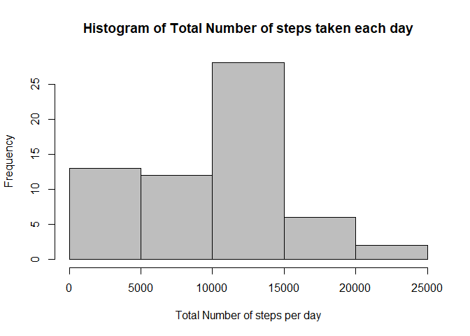
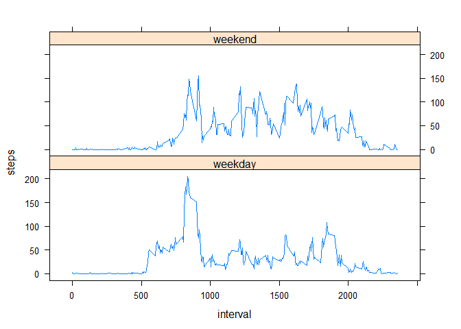

####LOAD AND PREPROCESS/TRANSFORM THE DATA INTO SUITABLE FORMAT FOR ANALYSIS

1. Load & Read the data using read.csv() setting the argument stringAsFactors = FALSE.
2. The date variable of the dataset is converted into 'Date' class (as a part of data transformation)
3. Output from  the below mentioned code chunk is a Tidy dataset because
    * Each measured variable is in one column
    * Each different observation of that variable are in a different row
    * There is only one table for the specified kind of variable
    

```r
activity <- read.csv("Activity Monitoring Data/activity.csv", header = TRUE, stringsAsFactors = FALSE)
activity$date <- as.Date(activity$date, format = "%Y-%m-%d")

#Dataset without Missing values (NAs)
activity_complete <- activity[complete.cases(activity), ]
head(activity_complete)
```

```
##     steps       date interval
## 289     0 2012-10-02        0
## 290     0 2012-10-02        5
## 291     0 2012-10-02       10
## 292     0 2012-10-02       15
## 293     0 2012-10-02       20
## 294     0 2012-10-02       25
```

####MEAN AND MEDIAN OF THE TOTAL NUMBER OF STEPS TAKEN PER DAY


```r
Total_steps <- tapply(activity$steps, activity$date, sum, na.rm = TRUE)
print(mean(Total_steps))
```

```
## [1] 9354.23
```

```r
print(median(Total_steps))
```

```
## [1] 10395
```

```r
#Histogram of total number of steps taken each day
hist(Total_steps, col = "grey", xlab = "Total Number of steps per day", ylab = "Frequency", main = "Histogram of Total Number of steps taken each day")
```

<!-- -->

```r
dev.copy(png, file = "plot_1.png")
```

```
## png 
##   3
```

```r
dev.off()
```

```
## png 
##   2
```

```r
#Mean & Median of total number of steps taken each day without missing values
Mean <- aggregate(steps ~ date, activity_complete, mean)
Median <- aggregate(steps ~ date, activity_complete, median)
Mean_and_Median <- merge(Mean, Median, by.x = "date", by.y = "date", all = TRUE)
names(Mean_and_Median)[2:3] <- c("mean", "median")
print(Mean_and_Median)
```

```
##          date       mean median
## 1  2012-10-02  0.4375000      0
## 2  2012-10-03 39.4166667      0
## 3  2012-10-04 42.0694444      0
## 4  2012-10-05 46.1597222      0
## 5  2012-10-06 53.5416667      0
## 6  2012-10-07 38.2465278      0
## 7  2012-10-09 44.4826389      0
## 8  2012-10-10 34.3750000      0
## 9  2012-10-11 35.7777778      0
## 10 2012-10-12 60.3541667      0
## 11 2012-10-13 43.1458333      0
## 12 2012-10-14 52.4236111      0
## 13 2012-10-15 35.2048611      0
## 14 2012-10-16 52.3750000      0
## 15 2012-10-17 46.7083333      0
## 16 2012-10-18 34.9166667      0
## 17 2012-10-19 41.0729167      0
## 18 2012-10-20 36.0937500      0
## 19 2012-10-21 30.6284722      0
## 20 2012-10-22 46.7361111      0
## 21 2012-10-23 30.9652778      0
## 22 2012-10-24 29.0104167      0
## 23 2012-10-25  8.6527778      0
## 24 2012-10-26 23.5347222      0
## 25 2012-10-27 35.1354167      0
## 26 2012-10-28 39.7847222      0
## 27 2012-10-29 17.4236111      0
## 28 2012-10-30 34.0937500      0
## 29 2012-10-31 53.5208333      0
## 30 2012-11-02 36.8055556      0
## 31 2012-11-03 36.7048611      0
## 32 2012-11-05 36.2465278      0
## 33 2012-11-06 28.9375000      0
## 34 2012-11-07 44.7326389      0
## 35 2012-11-08 11.1770833      0
## 36 2012-11-11 43.7777778      0
## 37 2012-11-12 37.3784722      0
## 38 2012-11-13 25.4722222      0
## 39 2012-11-15  0.1423611      0
## 40 2012-11-16 18.8923611      0
## 41 2012-11-17 49.7881944      0
## 42 2012-11-18 52.4652778      0
## 43 2012-11-19 30.6979167      0
## 44 2012-11-20 15.5277778      0
## 45 2012-11-21 44.3993056      0
## 46 2012-11-22 70.9270833      0
## 47 2012-11-23 73.5902778      0
## 48 2012-11-24 50.2708333      0
## 49 2012-11-25 41.0902778      0
## 50 2012-11-26 38.7569444      0
## 51 2012-11-27 47.3819444      0
## 52 2012-11-28 35.3576389      0
## 53 2012-11-29 24.4687500      0
```

####AVERAGE DAILY ACTIVITY PATTERN


```r
Total_interval <- aggregate(steps ~ interval, activity_complete, sum)
with(Total_interval, plot(interval, steps, type = "l", xlab = "5-minute interval", ylab = "Average number of steps taken, averaged across all days", main = "Time series plot of Average daily activity pattern", col = "dark red"))
```

<!-- -->

```r
dev.copy(png, file = "plot_2.png")
```

```
## png 
##   3
```

```r
dev.off()
```

```
## png 
##   2
```

```r
library(dplyr)
```

```
## 
## Attaching package: 'dplyr'
```

```
## The following objects are masked from 'package:stats':
## 
##     filter, lag
```

```
## The following objects are masked from 'package:base':
## 
##     intersect, setdiff, setequal, union
```

```r
Maximum_steps <- filter(Total_interval, steps == max(Total_interval))
print(Maximum_steps)
```

```
##   interval steps
## 1      835 10927
```

####IMPUTING MISSING VALUES


```r
Total_missing <- sum(is.na(activity))
print(Total_missing)
```

```
## [1] 2304
```

```r
#My strategy for filling in all of the missing values in the dateset (Median of total number of steps taken, averaged across all days for each interval)
activity_NA <- activity[is.na(activity), ]
Median_interval <- tapply(activity_complete$steps, activity_complete$interval, median)
Activity_NA <- data.frame()
for(i in 1:length(Median_interval))
{
	Initial <- activity_NA[activity_NA$interval == names(Median_interval[i]), ]
	Initial$steps <- Median_interval[i]
	Activity_NA <- rbind(Activity_NA, Initial)
}
Activity <- rbind(Activity_NA, activity_complete)
Activity <- arrange(Activity, date)

#Histogram, Mean and Median of Total number of steps taken each day
New_Total_steps <- aggregate(steps ~ date, Activity, sum)
print(mean(New_Total_steps$steps))
```

```
## [1] 9503.869
```

```r
print(median(New_Total_steps$steps))
```

```
## [1] 10395
```

```r
hist(New_Total_steps$steps, col = "dark green", xlab = "Total number of steps taken per day", ylab = "Frequency", main = "Histogram of Total number of stpes taken each day")
```

<!-- -->

```r
dev.copy(png, file = "plot_3.png")
```

```
## png 
##   3
```

```r
dev.off()
```

```
## png 
##   2
```

```r
New_Mean_steps <- aggregate(steps ~ date, Activity, mean)
New_Median_steps <- aggregate(steps ~ date, Activity, median)
New_mean_and_median <- merge(New_Mean_steps, New_Median_steps, by.x = "date", by.y = "date", all = TRUE)
names(New_mean_and_median)[2:3] <- c("mean", "median")
print(New_mean_and_median)
```

```
##          date       mean median
## 1  2012-10-01  3.9618056      0
## 2  2012-10-02  0.4375000      0
## 3  2012-10-03 39.4166667      0
## 4  2012-10-04 42.0694444      0
## 5  2012-10-05 46.1597222      0
## 6  2012-10-06 53.5416667      0
## 7  2012-10-07 38.2465278      0
## 8  2012-10-08  3.9618056      0
## 9  2012-10-09 44.4826389      0
## 10 2012-10-10 34.3750000      0
## 11 2012-10-11 35.7777778      0
## 12 2012-10-12 60.3541667      0
## 13 2012-10-13 43.1458333      0
## 14 2012-10-14 52.4236111      0
## 15 2012-10-15 35.2048611      0
## 16 2012-10-16 52.3750000      0
## 17 2012-10-17 46.7083333      0
## 18 2012-10-18 34.9166667      0
## 19 2012-10-19 41.0729167      0
## 20 2012-10-20 36.0937500      0
## 21 2012-10-21 30.6284722      0
## 22 2012-10-22 46.7361111      0
## 23 2012-10-23 30.9652778      0
## 24 2012-10-24 29.0104167      0
## 25 2012-10-25  8.6527778      0
## 26 2012-10-26 23.5347222      0
## 27 2012-10-27 35.1354167      0
## 28 2012-10-28 39.7847222      0
## 29 2012-10-29 17.4236111      0
## 30 2012-10-30 34.0937500      0
## 31 2012-10-31 53.5208333      0
## 32 2012-11-01  3.9618056      0
## 33 2012-11-02 36.8055556      0
## 34 2012-11-03 36.7048611      0
## 35 2012-11-04  3.9618056      0
## 36 2012-11-05 36.2465278      0
## 37 2012-11-06 28.9375000      0
## 38 2012-11-07 44.7326389      0
## 39 2012-11-08 11.1770833      0
## 40 2012-11-09  3.9618056      0
## 41 2012-11-10  3.9618056      0
## 42 2012-11-11 43.7777778      0
## 43 2012-11-12 37.3784722      0
## 44 2012-11-13 25.4722222      0
## 45 2012-11-14  3.9618056      0
## 46 2012-11-15  0.1423611      0
## 47 2012-11-16 18.8923611      0
## 48 2012-11-17 49.7881944      0
## 49 2012-11-18 52.4652778      0
## 50 2012-11-19 30.6979167      0
## 51 2012-11-20 15.5277778      0
## 52 2012-11-21 44.3993056      0
## 53 2012-11-22 70.9270833      0
## 54 2012-11-23 73.5902778      0
## 55 2012-11-24 50.2708333      0
## 56 2012-11-25 41.0902778      0
## 57 2012-11-26 38.7569444      0
## 58 2012-11-27 47.3819444      0
## 59 2012-11-28 35.3576389      0
## 60 2012-11-29 24.4687500      0
## 61 2012-11-30  3.9618056      0
```

####DIFFERENCES IN ACTIVITY PATTERNS BETWEEEN WEEKDAYS AND WEEKENDS


```r
library(lubridate)
```

```
## 
## Attaching package: 'lubridate'
```

```
## The following object is masked from 'package:base':
## 
##     date
```

```r
Activity$days <- wday(Activity$date)
for(i in 1:nrow(Activity))
{
	if(Activity$days[i] == 1)
	{
		Activity$category[i] = "weekend"
	}
  else if(Activity$days[i] >= 2 && Activity$days[i] <= 6)
	{
		Activity$category[i] = "weekday"
	}
	else if(Activity$days[i] == 7)
	{
		Activity$category[i] = "weekend"
	}
}
Activity <- transform(Activity, category = factor(category))
Average_steps <- aggregate(steps ~ interval + category, Activity, mean)
library(lattice)
xyplot(steps ~ interval | category, data = Average_steps, type = "l", layout = c(1, 2))
```

<!-- -->

```r
dev.copy(png, file = "plot_4.png")
```

```
## png 
##   3
```

```r
dev.off()
```

```
## png 
##   2
```
